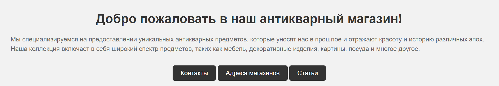

# Сайт антикварного магазина

**Описание проекта:** данный проект предназначен для использования антикварного магазина в своей работе. Здесь я описала 4 страницы - главная,
контакты, адреса магазинов и статьи.

В этом проекте пользователь может посмотреть контакты магазинов, их адреса, а также статьи, в которых описана информация об антиквариате.
Для каждой страницы присутствует соответствующая модель в файлах.

Используемый стек технологий: *python, os, sys, django*

**Инструкция по запуску:** для того, чтобы запустить данный проект, требуется скачать репозиторий и набрать в терминале *python -m manage 
runserver*.
